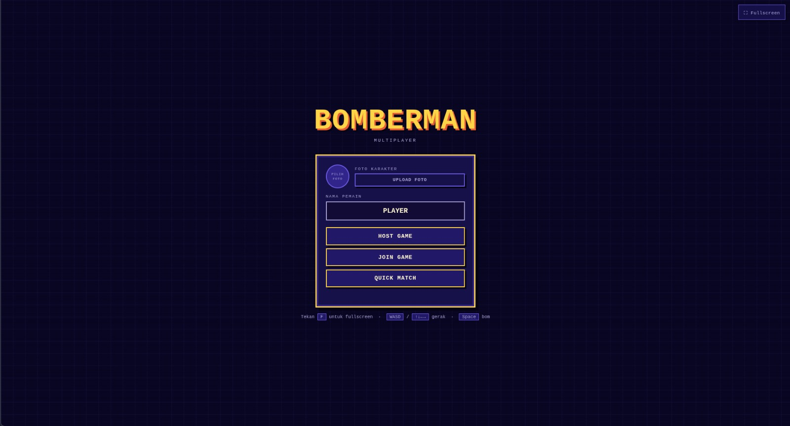
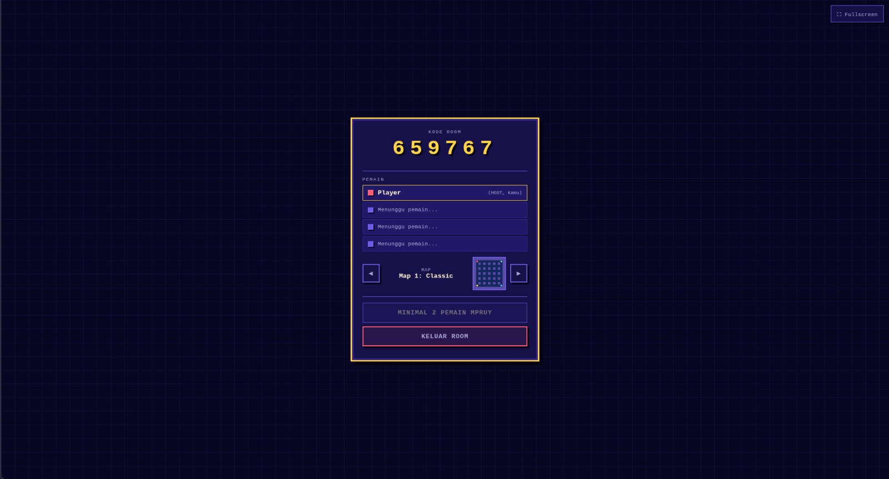
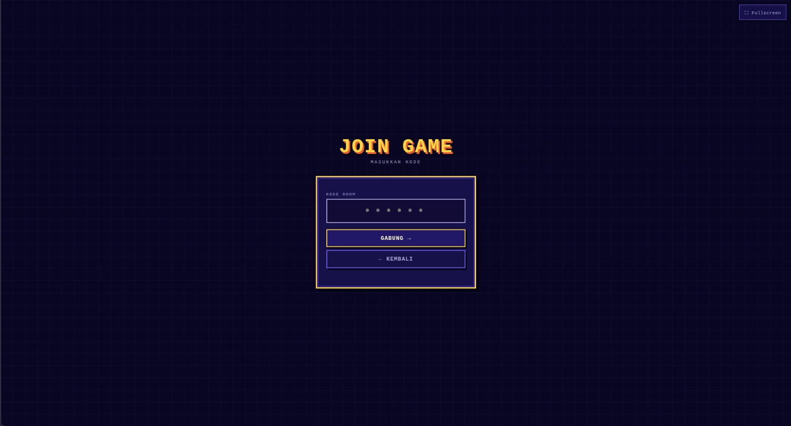
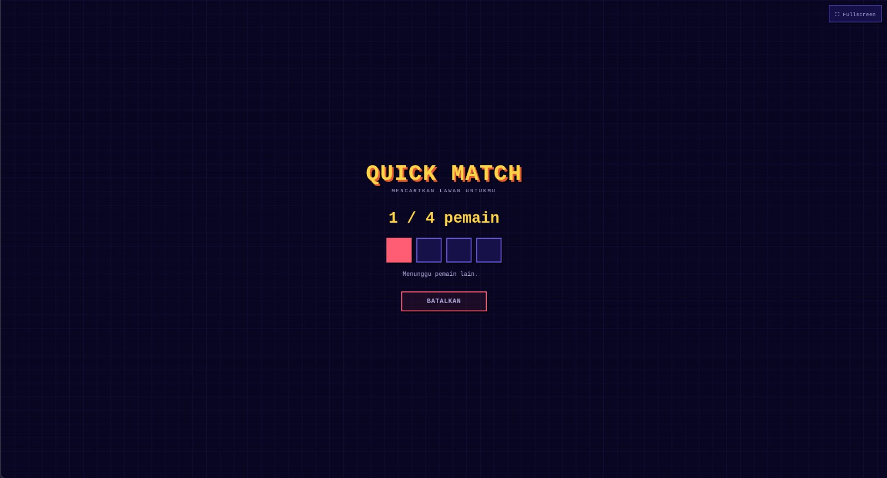
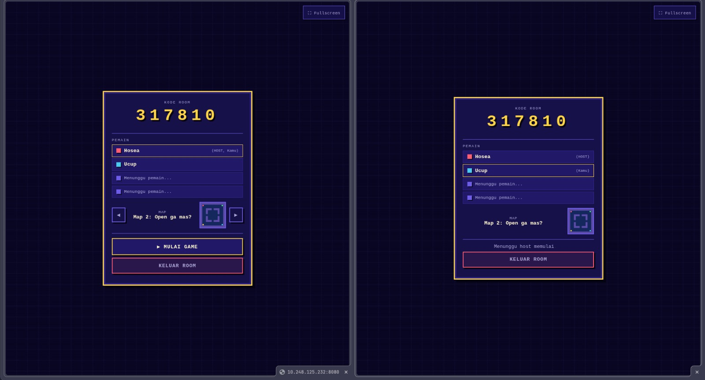
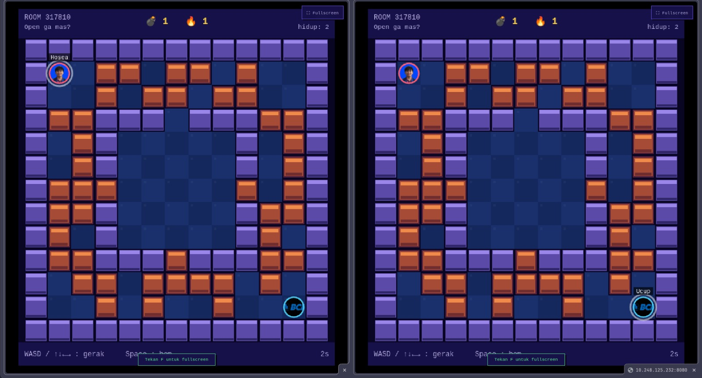
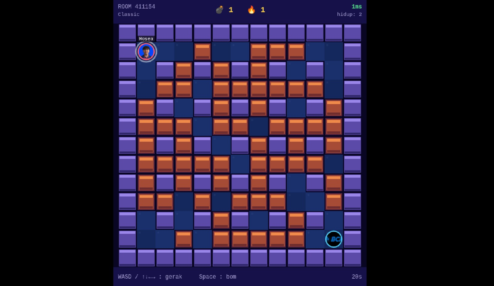
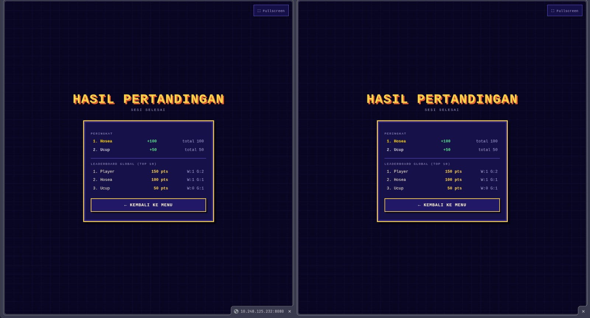

[](https://classroom.github.com/a/90Mprfp5)
# Network Programming - Final Project [G04]

## Anggota Kelompok
| Nama           | NRP        | Kelas     |
| ---            | ---        | ----------|
|Lyonel Oliver Dwiputra|5025241145|C|
|Hosea Felix Sanjaya|5025241177|C|
|Akmal Yusuf|5025241212|C|


## Link Youtube (Unlisted)
Link ditaruh di bawah ini
```
https://youtu.be/2wzNDgBAN68
```
## Penjelasan Program

Bomberman Multiplayer kami merupakan game multiplayer berbasis web yang dibuat menggunakan Python Socket Programming dan WebSocket.

Program menerapkan arsitektur `client-server` dimana browser berperan sebagai client dan server Python berperan sebagai game server yang mengatur seluruh logika permainan. Setiap pemain terhubung ke server menggunakan WebSocket sehingga komunikasi dapat dilakukan secara real-time.

Program menggunakan protokol WebSocket TCP.

TCP dipilih karena menyediakan komunikasi yang reliabel dan urutan pengiriman paket itu pasti.

WebSocket digunakan untuk komunikasi dua arah secara real-time antara browser dan game server.

Fitur yang tersedia:

- Multiplayer hingga 4 pemain
- Host dan Join Room pakai kode room
- Quick Match
- Realtime game
- Avatar pemain
- Leaderboard global
- Reconnect system 
- Spectator mode setelah pemain kalah
- Pemilihan map sebelum pertandingan dimulai

### Alur Sistem

1. Client membuka halaman web.
2. Browser melakukan koneksi WebSocket ke server.
3. Server membuat session pemain dan memberikan player_id.
4. Pemain dapat membuat room, bergabung ke room, atau masuk ke quick match.
5. Setelah game dimulai, server menjalankan game dan mengirimkan state permainan secara berkala.
6. Client menerima state terbaru lalu melakukan rendering arena.
7. Ketika pemain bergerak atau meletakkan bom, client mengirim event ke server.
8. Server memperbarui game state, lalu mengirimkan hasilnya ke seluruh pemain.
9. Setelah pertandingan selesai, hasil pertandingan disimpan ke database SQLite dan leaderboard diperbarui.

---

## Penjelasan File

### server.py

Merupakan inisiasi aplikasi.

Tugas utama:

- Menjalankan HTTP Server
- Menangani WebSocket Handshake
- Menerima koneksi client
- Menjalankan game loop
- Menghubungkan client dengan coordinator

### coordinator.py

Berfungsi sebagai pusat koordinasi permainan.

Tugas:

- Mengelola player session
- Mengelola lobby
- Mengelola room
- Mengatur matchmaking
- Menangani reconnect pemain
- Mengirim state permainan ke client

### room.py

Mengelola seluruh room yang aktif.

Tugas:

- Membuat room
- Join room
- Leave room
- Menentukan host room
- Menyimpan status room

### game.py

Berisi logika inti permainan.

Tugas:

- Pergerakan pemain
- Validasi collision
- Penempatan bom
- Ledakan bom
- Power up
- Eliminasi pemain
- Penentuan pemenang

### maps.py

Berisi konfigurasi arena permainan.

Tugas:

- Membuat layout map
- Menentukan spawn point
- Menentukan obstacle
- Menentukan blok yang dapat dihancurkan

### protocol.py

Implementasi protokol WebSocket.

Tugas:

- Encode frame
- Decode frame
- Handshake WebSocket
- Parsing 

### http_parser.py

Digunakan untuk membaca dan memproses HTTP Request saat proses upgrade ke WebSocket.

### database.py

Mengelola database SQLite.

Tugas:

- Menyimpan leaderboard
- Menyimpan statistik pertandingan
- Menyimpan skor pemain

### web/index.html

Halaman utama game.

Berisi:

- Main menu
- Lobby
- Quick match
- Gameplay
- Match result

### web/assets/app.js

Frontend game logic.

Tugas:

- Koneksi WebSocket
- Mengirim input pemain
- Menerima state game
- Rendering Canvas
- Menampilkan leaderboard

### web/assets/style.css

Mengatur tampilan antarmuka permainan.

---

## Mekanisme Komunikasi Jaringan

Program menggunakan protokol WebSocket yang berjalan di atas TCP.

Client mengirim pesan JSON ke server seperti:

```json
{
  "type": "MOVE",
  "col": 5,
  "row": 7
}
```

Server memproses aksi tersebut kemudian mengirim state terbaru kepada seluruh pemain yang berada dalam room yang sama.

Contoh pesan state:

```json
{
  "type": "STATE",
  "snapshot": {...}
}
```

Dengan mekanisme ini seluruh pemain selalu melihat kondisi permainan yang sama secara real-time.

---

## Cara Menjalankan Program

### Requirement

- Python 3.10 atau lebih baru
- Browser modern (Chrome, Edge, Firefox)

### 1. Clone Repository

```bash
git clone <repository-url>
cd bomberman
```

### 2. Jalankan Server

Windows

```bash
python server.py
```

Linux / MacOS

```bash
python3 server.py
```

Jika berhasil akan muncul:

```text
Bomberman WEB server running on port 8080
```

### 3. Buka Browser

Akses:

```text
http://localhost:8080
```

### 4. Multiplayer dalam Satu Jaringan

Cari IP server:

Windows

```bash
ipconfig
```

Linux

```bash
ip addr
```

Kemudian akses dari perangkat lain:

```text
http://IP_SERVER:8080
```

Contoh:

```text
http://192.168.1.10:8080
```

### 5. Memulai Permainan

1. Host membuat room.
2. Bagikan kode room kepada pemain lain.
3. Pemain lain melakukan join menggunakan kode tersebut.
4. Host menekan tombol Start Game.
5. Pertandingan dimulai.

## Screenshot Hasil

Halaman Awal Player 


Halaman Non-host (Join game) 

Quick Match 

Waiting room 

In game 


Scoreboard 
